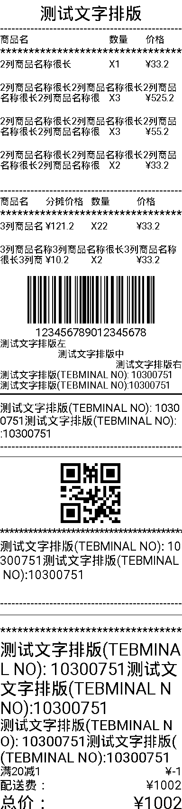

## 生成图片排版打印小票


## 支持格式排版

1. 各种字体，字号
2. 对齐模式
3. 单行虚线，实线，星线，空行，各种线条的
4. 条形码，二维码，添加图片
5. 竖列比例排版
6. 两端对齐

 

## 大致效果如下

- 





### 使用方式：

```Java
 ArrayList<PrintParameter> mParameters = new ArrayList<>();
            mParameters.add(PrintParameterFac.getContent("测试文字排版", PrintValue.TextSizeLevel_5, PrintValue.Center));
            mParameters.add(PrintParameterFac.getChartLine(PrintValue.Content_Line_dashed, PrintValue.TextSizeLevel_2));

            mParameters.add(PrintParameterFac.getSpliteCombination(1, 5, PrintValue.TextSizeLevel_1)
                    .addPrintParameter(new SpliteCombination(3, "商品名"))
                    .addPrintParameter(new SpliteCombination(1, "数量"))
                    .addPrintParameter(new SpliteCombination(1, "价格")));
            mParameters.add(PrintParameterFac.getChartLine(PrintValue.Content_Line_star, PrintValue.TextSizeLevel_3));

            mParameters.add(PrintParameterFac.getSpliteCombination(1, 5, PrintValue.TextSizeLevel_1)
                    .addPrintParameter(new SpliteCombination(3, "2列商品名称很长"))
                    .addPrintParameter(new SpliteCombination(1, "X1"))
                    .addPrintParameter(new SpliteCombination(1, "¥33.2")));
            mParameters.add(PrintParameterFac.getChartLine(PrintValue.Content_line_space, PrintValue.TextSizeLevel_2));

            mParameters.add(PrintParameterFac.getSpliteCombination(2, 5, PrintValue.TextSizeLevel_1)
                    .addPrintParameter(new SpliteCombination(3, "2列商品名称很长2列商品名称很长2列商品名称很长2列商品名称很长"))
                    .addPrintParameter(new SpliteCombination(1, "X3"))
                    .addPrintParameter(new SpliteCombination(1, "¥525.2")));
            mParameters.add(PrintParameterFac.getChartLine(PrintValue.Content_line_space, PrintValue.TextSizeLevel_2));

            mParameters.add(PrintParameterFac.getSpliteCombination(2, 5, PrintValue.TextSizeLevel_1)
                    .addPrintParameter(new SpliteCombination(3, "2列商品名称很长2列商品名称很长2列商品名称很长2列商品名称很长"))
                    .addPrintParameter(new SpliteCombination(1, "X3"))
                    .addPrintParameter(new SpliteCombination(1, "¥55.2")));
            mParameters.add(PrintParameterFac.getChartLine(PrintValue.Content_line_space, PrintValue.TextSizeLevel_2));

            mParameters.add(PrintParameterFac.getSpliteCombination(2, 5, PrintValue.TextSizeLevel_1)
                    .addPrintParameter(new SpliteCombination(3, "2列商品名称很长2列商品名称很长2列商品名称很长2列商品名称很长2列商品名称很长2列商品名称很长"))
                    .addPrintParameter(new SpliteCombination(1, "X2"))
                    .addPrintParameter(new SpliteCombination(1, "¥33.2")));
            mParameters.add(PrintParameterFac.getChartLine(PrintValue.Content_line_space, PrintValue.TextSizeLevel_2));
            mParameters.add(PrintParameterFac.getChartLine(PrintValue.Content_Line_dashed, PrintValue.TextSizeLevel_2));

            mParameters.add(PrintParameterFac.getSpliteCombination(1, 4, PrintValue.TextSizeLevel_1)
                    .addPrintParameter(new SpliteCombination(1, "商品名"))
                    .addPrintParameter(new SpliteCombination(1, "分摊价格"))
                    .addPrintParameter(new SpliteCombination(1, "数量"))
                    .addPrintParameter(new SpliteCombination(1, "价格")));
            mParameters.add(PrintParameterFac.getChartLine(PrintValue.Content_Line_star, PrintValue.TextSizeLevel_3));

            mParameters.add(PrintParameterFac.getSpliteCombination(2, 4, PrintValue.TextSizeLevel_1)
                    .addPrintParameter(new SpliteCombination(1, "3列商品名称很长"))
                    .addPrintParameter(new SpliteCombination(1, "¥121.2"))
                    .addPrintParameter(new SpliteCombination(1, "X22"))
                    .addPrintParameter(new SpliteCombination(1, "¥33.2")));
            mParameters.add(PrintParameterFac.getChartLine(PrintValue.Content_line_space, PrintValue.TextSizeLevel_2));

            mParameters.add(PrintParameterFac.getSpliteCombination(2, 4, PrintValue.TextSizeLevel_1)
                    .addPrintParameter(new SpliteCombination(1, "3列商品名称3列商品名称很长3列商品名称很长3列商品名称很长很长3列商品名称3列商品名称很长3列商品名称很长3列商品名称很长很长"))
                    .addPrintParameter(new SpliteCombination(1, "¥10.2"))
                    .addPrintParameter(new SpliteCombination(1, "X2"))
                    .addPrintParameter(new SpliteCombination(1, "¥33.2")));
            mParameters.add(PrintParameterFac.getChartLine(PrintValue.Content_line_space, PrintValue.TextSizeLevel_2));

            mParameters.add(PrintParameterFac.getBarCode("123456789012345678", false, 100));
            mParameters.add(PrintParameterFac.getContent("123456789012345678", PrintValue.TextSizeLevel_2, PrintValue.Center));
            mParameters.add(PrintParameterFac.getContent("测试文字排版左", PrintValue.TextSizeLevel_1, PrintValue.Left));
            mParameters.add(PrintParameterFac.getContent("测试文字排版中", PrintValue.TextSizeLevel_1, PrintValue.Center));
            mParameters.add(PrintParameterFac.getContent("测试文字排版右", PrintValue.TextSizeLevel_1, PrintValue.Right));
            mParameters.add(PrintParameterFac.getContent("测试文字排版(TEBMINAL NO): 10300751测试文字排版(TEBMINAL NO):10300751", PrintValue.TextSizeLevel_1, PrintValue.Left));
            mParameters.add(PrintParameterFac.getChartLineFull(PrintValue.TextSizeLevel_1, 3f));
            mParameters.add(PrintParameterFac.getContent("测试文字排版(TEBMINAL NO): 10300751测试文字排版(TEBMINAL NO):10300751", PrintValue.TextSizeLevel_2, PrintValue.Left));
            mParameters.add(PrintParameterFac.getChartLine(PrintValue.Content_Line_dashed, PrintValue.TextSizeLevel_2));
            mParameters.add(PrintParameterFac.getChartLine(PrintValue.Content_Line_full, PrintValue.TextSizeLevel_2));
            mParameters.add(PrintParameterFac.getQRCode("123456789012345678", 200));
            mParameters.add(PrintParameterFac.getChartLine(PrintValue.Content_Line_star, PrintValue.TextSizeLevel_2));
            mParameters.add(PrintParameterFac.getContent("测试文字排版(TEBMINAL NO): 10300751测试文字排版(TEBMINAL NO):10300751", PrintValue.TextSizeLevel_3, PrintValue.Left));
            mParameters.add(PrintParameterFac.getChartLine(PrintValue.Content_line_space, PrintValue.TextSizeLevel_3));
            mParameters.add(PrintParameterFac.getChartLine(PrintValue.Content_Line_dashed, PrintValue.TextSizeLevel_3));
            mParameters.add(PrintParameterFac.getChartLine(PrintValue.Content_Line_full, PrintValue.TextSizeLevel_3));
            mParameters.add(PrintParameterFac.getChartLine(PrintValue.Content_Line_star, PrintValue.TextSizeLevel_3));
            mParameters.add(PrintParameterFac.getContent("测试文字排版(TEBMINAL NO): 10300751测试文字排版(TEBMINAL NO):10300751", PrintValue.TextSizeLevel_5, PrintValue.Left));

            mParameters.add(PrintParameterFac.getContent("测试文字排版(TEBMINAL NO): 10300751测试文字排版(TEBMINAL NO):10300751", PrintValue.TextSizeLevel_4, PrintValue.Left));
            mParameters.add(PrintParameterFac.getLinked("满20减1", "¥-1", PrintValue.TextSizeLevel_2));
            mParameters.add(PrintParameterFac.getLinked("配送费：", "¥1002", PrintValue.TextSizeLevel_3));
            mParameters.add(PrintParameterFac.getLinked("总价：", "¥1002", PrintValue.TextSizeLevel_5));
            Bitmap textBitmap = new ImagePHelperV2().StringListtoBitmap(MainActivity.this, mParameters);
```
